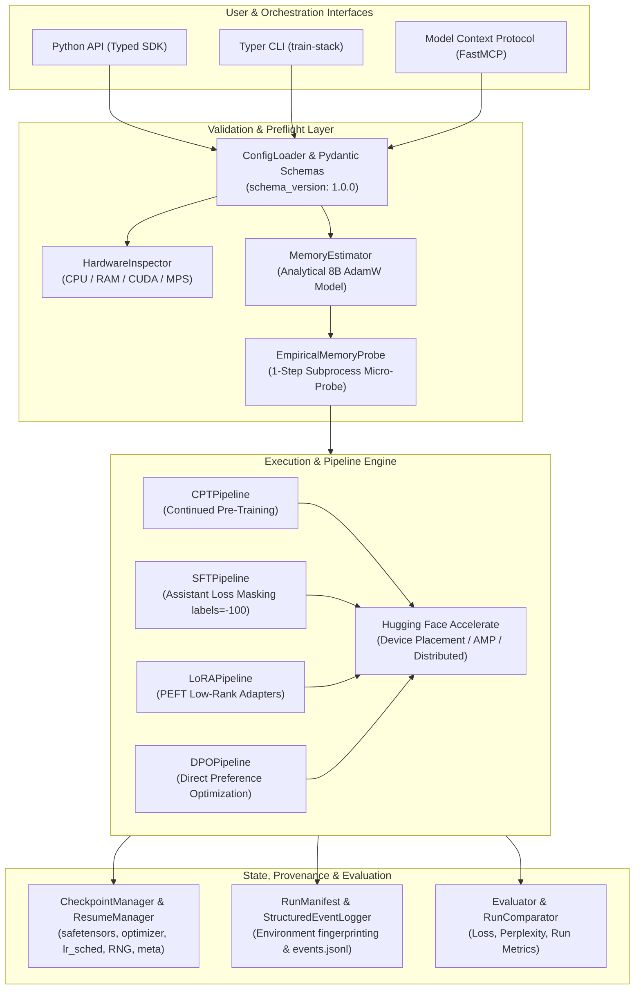

# LLM Training Stack ⚡

[](LICENSE)
[](https://python.org)
[](https://pytorch.org)
[](https://huggingface.co)
[](https://modelcontextprotocol.io)
[](https://github.com/menma4ever/llm-training-stack/actions/workflows/ci.yml)

A professional, modular open-source framework designed for machine learning engineers to **configure, validate, launch, monitor, deterministically resume, evaluate, and compare** real LLM training and adaptation workloads.

Built with **PyTorch, Hugging Face Transformers, PEFT, TRL, and Accelerate**, `llm-training-stack` provides triple interface parity:
1. **Typed Python API** for programmatic pipelines, custom scripts, and SDK integration.
2. **Typer CLI (`train-stack`)** for terminal workflows, automated scripts, and CI environments.
3. **Safe Model Context Protocol (MCP)** server for autonomous AI agent workflows with separated read/probe and launch permissions.

---

## 🏛️ System Architecture



---

## 🚀 Key Architectural Pillars

- **Unified Upstream Backend Integration**: Direct execution of Hugging Face `transformers.Trainer`, `trl.SFTTrainer`, `trl.DPOTrainer`, and `accelerate`.
- **Honest Memory Preflight**: Combines analytical static memory estimation with a **bounded empirical probe** executing a 1-step forward/backward pass inside an isolated subprocess with tree reaping. Never promises unmeasured fit.
- **Deterministic Checkpoint Resumption**: Full bundle persistence saving model weights (`safetensors`), `optimizer.pt`, `lr_scheduler.pt`, `rng_state.pt` (CPU, CUDA, NumPy, Python standard library), and `metadata.json` (step, epoch, data index). Resumed trajectories achieve exact bit-for-bit loss continuity.
- **Durable Lifecycle Management**: Comprehensive job lifecycle API supporting background job submission, status polling, streaming log inspection, and cooperative cancellation.
- **Held-Out Evaluation with Response-Only Masking**: Standardized causal language model evaluation enforcing assistant response loss masking (`labels = -100`) and deterministic dataset content fingerprinting.
- **Safe Agent Automation**: MCP server strictly separates read-only telemetry and bounded memory probes from training execution. Protected launches mandate operator policy enablement (`TRAIN_STACK_ALLOW_LAUNCH=1`) and plan-bound HMAC authorization grants.

---

## 📊 Support & Hardware Verification Matrix

For complete details on tested hardware, memory bounds, and distributed roadmaps, see [COMPATIBILITY.md](COMPATIBILITY.md).

| Target Compute | Status | Verification Evidence | Notes |
|---|---|---|---|
| **Local CPU** (Windows x86_64, 32GB RAM) | 🟢 **Verified & Tested** | 114 passing tests (`TEST_SUITE_EVIDENCE_14.log`) & installed virtualenv (`FINAL_INSTALLED_CANDIDATE_EVIDENCE.log`) | Verified on Intel Core i5-12400F with PyTorch 2.14.1+cpu. Only Windows CPU is empirically verified on host. |
| **Local CPU** (Linux / macOS) | ⚠️ **Architecturally Supported** | Empirically Unverified on Host | Cross-platform abstractions unit-tested; pending physical Linux/macOS runner execution. |
| **Single GPU** (NVIDIA CUDA) | ⚠️ **Architecturally Supported** | Hardware-Unverified on Host | Full CUDA & SDPA kernel integration ready; unverified until physical GPU attached. |
| **Multi-GPU** (DDP / FSDP2) | ⚠️ **Architecturally Supported** | Hardware-Unverified on Host | Native `torch.distributed.fsdp.fully_shard` hooks; requires multi-GPU hardware. |
| **DeepSpeed ZeRO-1/2/3** | ⚠️ **Architecturally Supported** | Hardware-Unverified on Host | Accelerate DeepSpeed plugin configuration ready; hardware execution pending. |
| **Multi-Node Distributed** | 🗺️ **Roadmap Extension** | Interface design in architecture spec | Slurm/Torchrun extension planned (see [COMPATIBILITY.md](COMPATIBILITY.md)). |

---

## 🛠️ Installation

`llm-training-stack` is packaged with modular dependency groups so the core framework remains lightweight and embeddable:

```bash
# Clone the repository
git clone https://github.com/menma4ever/llm-training-stack.git
cd llm-training-stack

# Option 1: Minimal Core installation (PyTorch, Transformers, PEFT, TRL, Accelerate, CLI)
pip install -e .

# Option 2: With Model Context Protocol (MCP) server support
pip install -e ".[mcp]"

# Option 3: With test suite dependencies (pytest, pytest-cov)
pip install -e ".[test]"

# Option 4: Full development setup (MCP, pytest, formatting, linters)
pip install -e ".[dev]"
```

Verify the installation:
```bash
train-stack inspect
```

---

## ⚡ Quickstart

### 1. Terminal CLI (`train-stack`)

```bash
# 1. Inspect host hardware and compute devices
train-stack inspect

# 2. Run analytical preflight and empirical memory probe
train-stack preflight --config examples/training_config.yaml

# 3. Launch training job synchronously
train-stack train --config examples/training_config.yaml

# 4. Or submit an asynchronous managed background job
train-stack submit --config examples/training_config.yaml

# 5. Monitor status and logs of background runs
train-stack status ./runs/job_1234
train-stack logs ./runs/job_1234 --tail 25

# 6. Evaluate held-out model loss and perplexity
train-stack eval --model ./runs/lora_demo/checkpoint-10 --dataset ./data/eval_data.jsonl

# 7. Resume an interrupted training run from a complete bundle
train-stack train --config examples/training_config.yaml --resume ./runs/checkpoint-10

# 8. Audit checkpoint bundle completeness
train-stack resume --checkpoint ./runs/checkpoint-10

# 9. Compare multiple training runs with compatibility validation
train-stack compare ./runs/run_a ./runs/run_b
```

See [docs/cli_reference.md](docs/cli_reference.md) for full CLI command details and options.

---

### 2. Python API

```python
from llm_training_stack.config import (
    TrainingJobConfig, TaskType, ModelConfig, DatasetConfig, PeftConfig, HardwareConfig
)
from llm_training_stack.pipelines import LoRAPipeline

config = TrainingJobConfig(
    task_type=TaskType.LORA,
    model=ModelConfig(model_name_or_path="Qwen/Qwen2.5-0.5B"),
    dataset=DatasetConfig(dataset_name_or_path="synthetic"),
    peft=PeftConfig(r=16, lora_alpha=32, target_modules=["q_proj", "v_proj"]),
    hardware=HardwareConfig(per_device_train_batch_size=2, gradient_accumulation_steps=4),
    max_steps=100,
)

pipeline = LoRAPipeline(config)
result = pipeline.train()
print("Training Result:", result)
```

See [docs/api_reference.md](docs/api_reference.md) for complete API documentation.

---

### 3. Runnable Quickstart Examples & Verification Scripts

Validated end-to-end example scripts are provided in `examples/`:

- **Continued Pre-Training**: `python examples/cpt_quickstart.py`
- **Supervised Fine-Tuning with LoRA**: `python examples/sft_lora_quickstart.py`
- **Direct Preference Optimization**: `python examples/dpo_alignment.py`
- **Sample YAML Configuration**: `examples/training_config.yaml`

> [!NOTE]
> **Portable Unique-Output Discipline**: When executing verification scripts or custom training pipelines, always specify unique output paths (e.g. `--output-dir ./runs/run_<timestamp>`) to preserve existing historical runs (`artifacts/installed_candidate_run/`, `artifacts/real_smoke_run/`).
>
> **Fixture Scope vs General Quality**: The pinned SmolLM-135M smoke run (model revision `1d461723eec654e65efdc40cf49301c89c0c92f4`, executed from source commit `5d5811746bda06e6bc7662fcb46b8d21ce2a5650` with `is_dirty: true`) exercises 4 steps on CPU with 10 training samples and 5 held-out eval samples (`max_seq_length=64`). Run comparison explicitly sets `strict_compatibility=False` and asserts `is_comparable=True`. These measurements verify CPU mechanics and evaluation data flow on small fixtures, not general model quality or GPU capability.

---

### 4. Safe Model Context Protocol (MCP) Server

Launch the safe MCP server for AI agent orchestration:

```bash
train-stack mcp
```

Exposed MCP Tools:
- `inspect_hardware()`: Read-only host hardware telemetry.
- `estimate_memory()`: Analytical static memory breakdown.
- `inspect_checkpoint(checkpoint_dir)`: Checkpoint bundle verification.
- `compare_runs(run_dirs)`: Markdown comparison table.
- `submit_training_job()`: Asynchronous managed job submission.
- `get_training_job_status()`: Status tracking for managed jobs.
- `cancel_training_job()`: Cancellation for active jobs.
- `get_training_job_logs()`: Telemetry log streaming.
- `launch_training(config_json, authorized=True)`: Protected execution requiring operator policy (`TRAIN_STACK_ALLOW_LAUNCH=1`) and plan-bound HMAC grant.

---

## 📚 Documentation Index

- 🏛️ [Architecture & Technical Rationale](docs/architecture.md) — System design, dual-stage preflight, and security model.
- 📊 [Hardware & Framework Compatibility Matrix](COMPATIBILITY.md) — CPU/GPU support matrix, precision types, and multi-node roadmap.
- 🎯 [Single-GPU CUDA Validation Plan](docs/cuda_validation_plan.md) — Scoped empirical validation protocol for real GPU training runs, peak VRAM, throughput, and resume fidelity.
- 📋 [CLI Reference](docs/cli_reference.md) — Complete `train-stack` command reference.
- 📦 [Python API Reference](docs/api_reference.md) — Public classes, configuration models, and pipelines.
- 🔄 [Reproducibility & Resumption Guide](docs/reproducibility.md) — Deterministic resumption proof, bundle anatomy, and provenance.
- 🤝 [Contributing Guidelines](CONTRIBUTING.md) — Code style, testing requirements, and hygiene rules.
- 🔒 [Security Policy](SECURITY.md) — Vulnerability reporting and least-privilege principles.

---

## 🧪 Testing & Verification

Run the automated test suite across all modules:

```bash
pytest tests/ -v
```

All 116 automated tests across 12 test modules pass locally:
- Checkpoints & rotation (`test_checkpoints.py` — 2 tests)
- CLI commands & lifecycle (`test_cli.py` — 10 tests)
- Configuration schemas & loaders (`test_config.py` — 4 tests)
- Held-out evaluation & comparison (`test_eval.py` — 12 tests)
- Lifecycle manager (`test_lifecycle.py` — 4 tests, including unacknowledged cancellation timeout assertion)
- MCP in-process tool dispatch & HMAC grant binding (`test_mcp.py` — 17 tests)
- MCP stdio JSON-RPC protocol & mutation security (`test_mcp_stdio.py` — 9 tests)
- Negative test cases & strict boundary rejection (`test_negative_cases.py` — 9 tests)
- Upstream pipelines CPT/SFT/LoRA/DPO & SmolLM-135M smoke (`test_pipelines.py` — 14 tests)
- Hardware preflight, RSS memory & tokenizer audits (`test_preflight.py` — 24 tests)
- Provenance & immutable launch manifests (`test_provenance.py` — 3 tests)
- Deterministic resume continuity, odd accumulation & DPO invariance (`test_resume_continuity.py` — 6 tests)

> [!NOTE]
> **Host vs Installed Evidence Distinction**: Source-host test execution is preserved in historical logs (initial 114-test baseline in `TEST_SUITE_EVIDENCE_14.log`, 239.41s, SHA256 `2b2e83fb2b26daea3429d4c3dbd2f9ec3b705ca5f24762d85ca38c2368fae240`). Pristine installed virtual environment execution is separately verified in `FINAL_INSTALLED_CANDIDATE_EVIDENCE.log` (15,408 B, SHA256 `8b600ff928767c30f0724e08be1326510475dde6efa21c3ca1ab95700ec7982c`), covering package imports, `pip check`, entrypoint verification, candidate SmolLM-135M adaptation, lifecycle unack/ack cancellation, and MCP tools under declared dependencies (`torch 2.14.1+cpu`, `transformers 5.19.0`, `accelerate 1.15.0`, `peft 0.21.2`, `trl 1.14.1`).

---

## 🔒 Release & Publication Status

The repository has completed release engineering acceptance across clean distribution wheel packaging, isolated virtual environment installation, provenance auditing, and automated test suite verification.

---

## 📜 License

Licensed under the **Apache License, Version 2.0**. See [LICENSE](LICENSE) for details.
