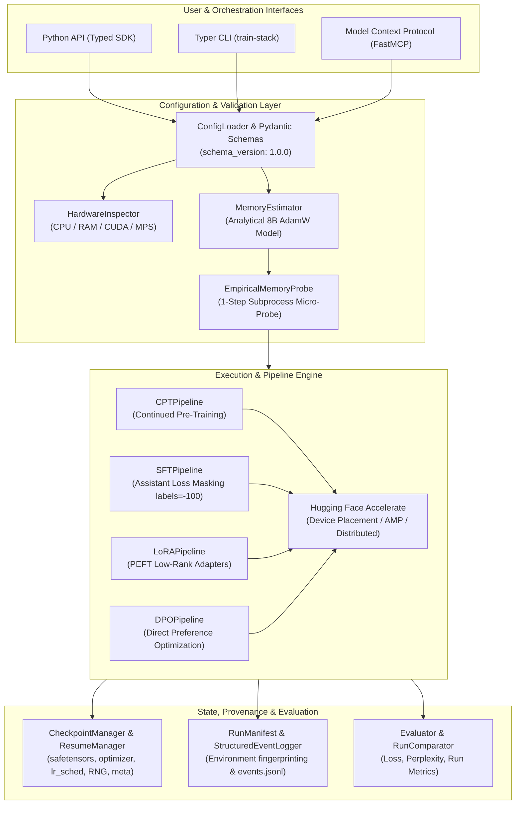
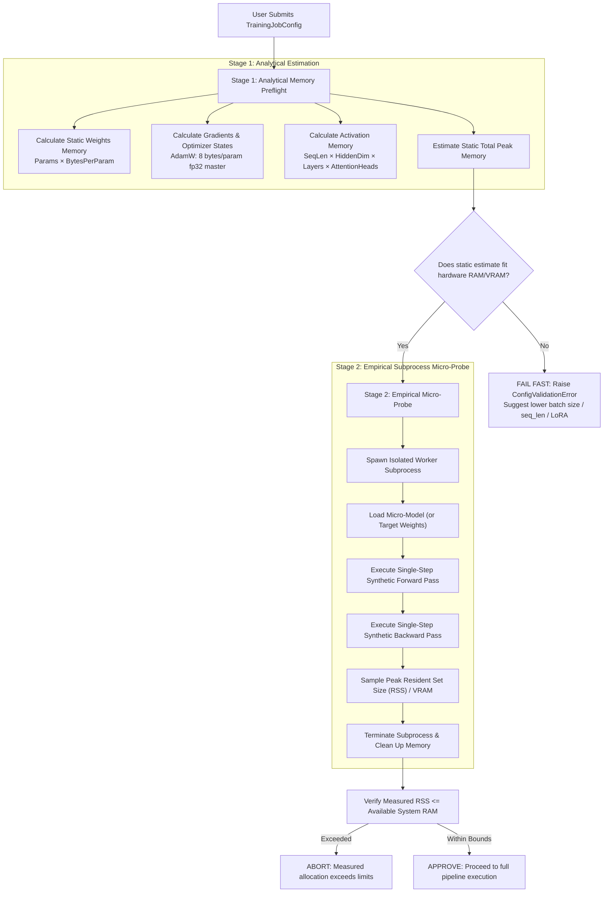
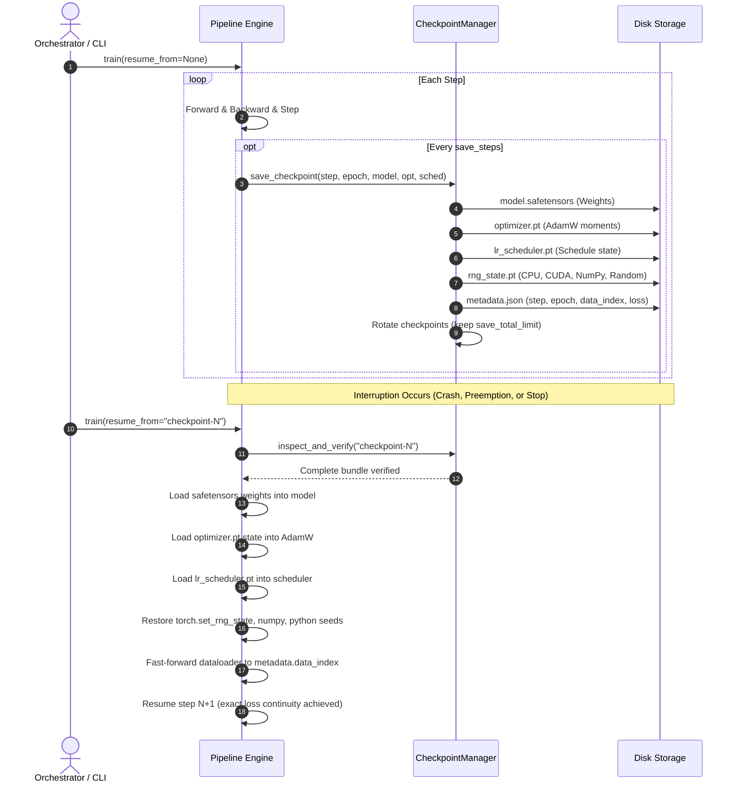
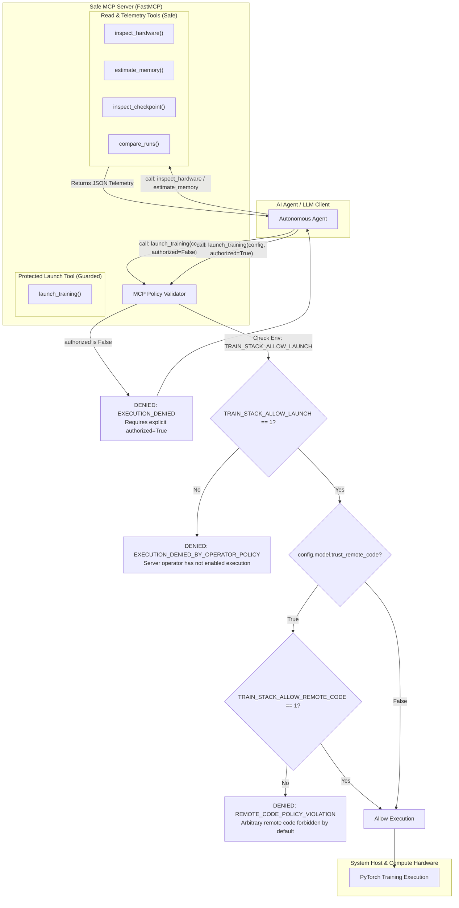

# LLM Training Stack — Architecture & Technical Rationale

This document details the architectural design, component interactions, safety mechanisms, and research rationale behind the **LLM Training Stack**.

---

## 🏛️ System Architecture Overview

The LLM Training Stack is built on a modular, layered architecture designed for deterministic execution, strict resource bounds, and interface parity across Python API, CLI, and MCP.

---

## 🔬 Dual-Stage Memory Preflight Architecture

Memory estimation in LLM training often suffers from either overly optimistic static calculations or out-of-memory (OOM) crashes during mid-run execution. The stack solves this via a **dual-stage preflight architecture**:

### Preflight Rationale:
- **Never Promise Unmeasured Fit**: Analytical approximations are tagged `[ESTIMATED]` because dynamic allocation, fragmentation, CUDA kernel workspaces, and PyTorch caching cannot be predicted purely from parameter counts.
- **Subprocess Isolation**: The empirical micro-probe executes in an isolated Python subprocess so that any potential OOM or memory fragmentation does not contaminate the primary orchestrator session.

---

## 🔄 Deterministic Resumption Lifecycle

The stack provides mathematically exact training resumption: an interrupted and resumed run produces identical loss trajectories to an uninterrupted baseline run.

---

## 🛡️ Model Context Protocol (MCP) Security Architecture

When an autonomous AI agent interacts with training infrastructure, execution boundaries must prevent unauthorized compute expenditures, credential theft, and arbitrary code execution.

### Security Invariants:
1. **No Arbitrary Execution**: There is **no shell tool**, **no `eval()` tool**, and no arbitrary file system write capability exposed over MCP.
2. **Double Authorization Barrier**:
   - The AI agent must supply `authorized=True`.
   - The host system operator must explicitly export `TRAIN_STACK_ALLOW_LAUNCH=1`.
3. **Remote Code Gating**: Models with `trust_remote_code=True` are rejected unless the host administrator explicitly set `TRAIN_STACK_ALLOW_REMOTE_CODE=1`.

---

## 🎯 Training Workflows & Rationale

### 1. Continued Pre-Training (CPT)
- **Goal**: Ingest domain-specific corpora (legal, medical, code) to adapt base vocabulary distributions.
- **Loss Function**: Standard autoregressive cross-entropy over causal tokens.
- **Dataset Packing**: Supports concatenation of token sequences with end-of-sequence delimiters up to `max_seq_length`.

### 2. Supervised Fine-Tuning (SFT) with Masking
- **Assistant-Only Loss Masking**: Crucial for conversational alignment. Prompt tokens are assigned `labels = -100` so that gradients are only computed with respect to assistant response tokens.
- **Empty Prompt / Target Validation**: Rejects malformed examples with empty prompts or empty targets during dataset preprocessing.

### 3. Parameter-Efficient Fine-Tuning (LoRA / PEFT)
- **Architecture**: Injects trainable rank-decomposition matrices ($W + \Delta W$, where $\Delta W = B \times A$) into attention projection layers (`q_proj`, `v_proj`).
- **Memory Efficiency**: Reduces trainable parameters to $< 1\%$ of base model size, lowering optimizer memory from $8 \times N$ bytes to $8 \times M$ bytes ($M \ll N$).

### 4. Direct Preference Optimization (DPO)
- **Architecture**: Optimizes policies directly on preference pairs $(x, y_w, y_l)$ without needing an explicit separate reward model:
$$\mathcal{L}_{\text{DPO}}(\pi_\theta; \pi_{\text{ref}}) = -\mathbb{E}_{(x, y_w, y_l)} \left[ \log \sigma \left( \beta \log \frac{\pi_\theta(y_w|x)}{\pi_{\text{ref}}(y_w|x)} - \beta \log \frac{\pi_\theta(y_l|x)}{\pi_{\text{ref}}(y_l|x)} \right) \right]$$
- **Input Validation**: Automatically rejects identical pairs ($y_w = y_l$) or empty responses before starting training.
